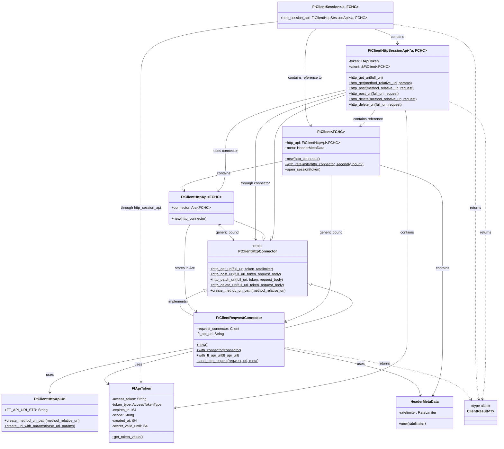

# API Structure Relationships

## Mermaid Diagram

## Explanation of Relationships

### Core Components

1. **FtClientHttpConnector (Trait)**: Defines the interface for HTTP connectors that can communicate with the 42 API. It has methods for GET, POST, PATCH, DELETE requests and URI creation.

2. **FtClientReqwestConnector (Implementation)**: A concrete implementation of FtClientHttpConnector using the reqwest HTTP client library. It handles the actual network communication with the 42 Intra API.

3. **FtClient<FCHC>**: The main client structure that serves as the entry point for API interactions. It contains:
   - `http_api`: An instance of FtClientHttpApi that manages the connector
   - `meta`: HeaderMetaData containing rate limiting information

4. **FtClientSession<'a, FCHC>**: An authenticated session that holds a valid token and allows making authenticated API calls.

### Data Flow

1. User creates an `FtClient` with a connector (typically `FtClientReqwestConnector`)
2. User opens a session with a valid `FtApiToken` using `client.open_session(token)`
3. User makes API calls through the session (e.g., `session.users()`)
4. The session uses its internal `FtClientHttpSessionApi` to make requests
5. The session API calls the underlying connector to perform HTTP operations
6. The connector handles authentication, rate limiting, and communication with the API

### Thread Safety and Concurrency

- `FtClientHttpApi` stores the connector in an `Arc<FCHC>` to allow sharing across threads
- All connector implementations must implement `Send` and `Sync` for thread safety
- The generic `FCHC` parameter allows for different connector implementations while maintaining type safety

This architecture allows for flexible connector implementations while providing a consistent API interface for users of the library.
